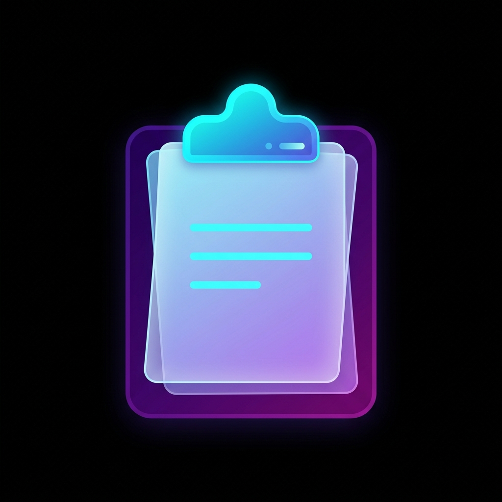

<div align="center">
  <br />
  
  <h2>ClipPad</h2>
  <p>
    <b>Professional, local-first contextual clipboard with immutable pinning.</b>
  </p>
  <br />

  <p>
    <a href="#features">Features</a> •
    <a href="#installation">Installation</a> •
    <a href="#usage">Usage</a> •
    <a href="#architecture">Architecture</a>
  </p>
</div>

---

ClipPad is a modern, elegantly designed clipboard manager built directly into your browser's side panel. It silently captures your copied text, pairs it with the precise context of the webpage you copied it from, and presents it in a highly responsive, glassmorphic interface. 

Never lose track of important snippets, reference links, or notes again.

## Features

- **Contextual Capture**  
  Automatically records the page title and source URL alongside your copied text, so you always know exactly where a snippet came from.

- **Persistent Pinning**  
  Lock essential clips in place so they are never overwritten. Pinned clips receive a distinct visual emphasis.

- **Lightning Fast Search**  
  Instantly filter your clipboard history in real-time.

- **Premium Aesthetics**  
  Zinc-inspired dark mode, subtle staggered micro-animations, custom SVG iconography, and glassmorphic header elements.

- **Local-First Privacy**  
  All data is stored securely within your browser's local storage. No external servers, no telemetry.

## Getting Started (Local Setup)

> **Note:** ClipPad is not yet published to the Chrome Web Store. You can easily install and run it locally by following these instructions.

1. Clone this repository directly to your machine:
   ```bash
   git clone https://github.com/vijayrajeshr/ClipPad.git
   ```

2. Open Google Chrome and navigate to the extensions dashboard:
   ```text
   chrome://extensions/
   ```

3. Enable **Developer mode** via the toggle in the top right corner.

4. Click **Load unpacked** and select the cloned `ClipPad` folder from your machine.

5. *Tip:* Click the puzzle piece icon in Chrome to **Pin** the extension to your toolbar. You can now use `Ctrl+Shift+K` (or `Cmd+Shift+K` on Mac) to instantly toggle the side panel!

*(For Developers)*: Whenever you make code changes, simply click the **Refresh (↺)** icon on the ClipPad card in your extensions page to hot-reload your updates.

## Usage

Once installed, ClipPad runs seamlessly in the background. 

1. Highlight and copy any text on a webpage.
2. Open the ClipPad Side Panel.
3. Your copied text will instantly animate into the list, complete with a hyperlink back to the source webpage.
4. Click the **Pin icon** to lock a clip permanently, or click the **Copy icon** to push it back to your active clipboard.

## Architecture

ClipPad is purposefully built with vanilla web technologies to ensure maximum performance, instant load times, and minimal memory overhead.

- **Manifest V3** — Conforms to modern, secure extension standards.
- **Service Workers** — Event-driven background processing via `background.js`.
- **Content Scripts** — Securely extracts context via `content.js`.
- **Vanilla JS & CSS** — Zero bulky dependencies. Pure performance and custom styling.

<br />

<div align="center">
  <p>Developed with precision by <a href="https://github.com/vijayrajeshr">Vijay</a></p>
</div>
